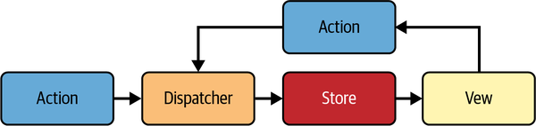

# Fluent React - Notes
Build Fast, Performant, and Intuitive Web Applications

## 1. The Entry-Level Stuff
この章では、Reactの簡単な歴史、初期の価値提案、およびスケールにおける安全で予測可能で効率的な UI の更新問題の解決方法について取り上げている。また、Reactのコンポーネントモデルについても触れ、なぜこれが Web UI に革命をもたらしたのかについて議論している。

### なぜ React は存在するのか？
一言で言えば「アップデート」。ウェブサイトは静的なものでなく、常に新しいデータを瞬時に表示する必要がある。ただ、その際以下の問題が考えられる：
1. Performance
   - ウェブページの更新を行う際、ブラウザにページの全レイアウトを再計算（リフロー）し、ページを再描画させる作業を毎回行う。
2. Reliability
   - ウェブページでの状態（state）の管理。
3. Security
   - クロスサイトスクリプティング（XSS）やクロスサイトリクエストフォージェリ（CSRF）などを防ぐために、ページに注入するすべてのHTMLとJavaScriptを必ずサニタイズする必要がある。

コードを維持可能、再利用可能、スケールに応じて予測可能な方法でパッケージ化することは、Reactなどのフレームワークが登場するまで業界で標準化されたコンセンサスがなかった。

### React の前
#### jQuery:
- jQueryは、ユーザーインターフェイス自体を直接（DOM）操作するためのツールとして利用されている。
    > DOMは、HTMLやXMLのドキュメントをオブジェクトとして扱うための仕組みで、これを「ツリー構造」として表現している。
- jQueryは「副作用の多い」方法で動作し、常に自身の制御外の状態と相互作用し、変更を加える。コードのどこからでもページの構造を直接的かつグローバルに変更できてしまうため、保守やデバッグが困難。
#### Backbone: 
- クライアントサイド MVC
#### KnockoutJS:
- クライアントサイド MVVM
- Knockout.jsは、View の内容と ViewModel の「状態保持オブジェクト」の紐づけをしてくれる役割を持つ。
- Backbone ではできなかったビューとモデルの間の同期を自動的に管理し、変更をリアルタイムで反映する。
#### AngularJS: 
- 2010年に Google が開発。
- 双方向データバインディングで、データとUIを双方向に結びつけ、UIが変更されれば自動的にデータが変更され、データが変更されると自動的にUIが変更される。
  > 双方向データバインディングとは、View の変更と Model の変更を ViewModel によって共通化する。View を更新すると Model の値が、Model が更新されると View の値が連動して反映される。

### React の誕生
2013年に Meta (旧Facebook) が OSS としてリリース
#### 宣言的UI とコンポーネント志向:
宣言的 UI は、最終的な UI がどのようになるか先に記述するアプローチ。宣言的の対義語が命令的であり、明示的に指示していくアプローチ（jQueryがそれ）。

```js
// 命令的 UI（jQuery）の場合
(function myApp() {
  var listItems = ["I love", "React", "and", "TypeScript"];
  var parentList = document.getElementById("list-parent");
  var addForm = document.getElementById("add-item-form");
  var newListItemLabel = document.getElementById("new-list-item-label");

  addForm.onsubmit = function (event) {
    event.preventDefault();
    listItems.push(newListItemLabel.value);
    renderListItems();
  };

  function renderListItems() {
    for (i = 0; i < listItems.length; i++) {
      var el = document.createElement("li");
      el.textContent = listItems[i];
      parentList.appendChild(el);
    }
  }

  renderListItems();
})();
```

```js
// 宣言的 UI（React）の場合
function MyList() {
  const [items, setItems] = useState(["I love"]);

  return (
    <div>
      <ul>
        {items.map((i) => (
          <li key={i /* keep items unique */}>{i}</li>
        ))}
      </ul>
      <NewItemForm onAddItem={(newItem) => setItems([...items, newItem])} />
    </div>
  );
}
```

そして、React はコンポーネント志向であり、UI を Reusable なコンポーネントに分割し、それらのコンポーネントを組み合わせて最終的な UI を構築する。各コンポーネントは独自に状態やイベントを保持して、外から渡されたプロパティ（props）に基づいて表示を決定する。

コンポーネントは状態を引数にとって DOM をリターンする関数のようなもので、状態が変わる毎にコンポーネントを実行して新しい DOM を構築する。状態が変わる度にコンポーネントをレンダリングして、DOM をゼロから構築するため、更新について考慮する必要がそもそもない。これが宣言的 UI の本質。

状態の変化によって DOM をゼロから構築する、という手法は実際の DOM で行うと描画コストが重く、画面のチラつきやイベントリセットなどの課題があり実現が困難であったが、この問題を解決したのが仮想 DOM。

#### 仮想 DOM:
仮想 DOM は実際の DOM と同じ構造を持つ、軽量な JavaScript オブジェクトである（詳しくは3章に記載）。仮想 DOM も DOM と同様にツリー構造であるため容易に比較を行うことが出来、現在の仮想 DOM ツリーと前回の仮想 DOM ツリーを比較して差分箇所を特定することで、実際の DOM に差分のみを適用する。このプロセスを reconciliation と呼ぶ（詳しくは4章に記載）。

React は各コンポーネントが独自の状態を保持するように設計されており、DOM の直接的な操作を避け、各コンポーネントが独立して動作し、状態管理が容易になっている。また、コンポーネントが状態の変化に応じて構築する DOM を仮想 DOM に向けることで、DOM の更新に関するパフォーマンスの課題を改善し、宣言的 UI の実現を可能としている。

以下のコンポーネントを例とする。
```js
import React, { useState } from "react";

function LikeButton() {
  const [likes, setLikes] = useState(0);

  function handleLike() {
    setLikes(likes + 1);
  }

  return (
    <div>
      <button onClick={handleLike}>Like</button>
      <p>{likes} Likes</p>
    </div>
  );
}

export default LikeButton;
```

```LikeButton``` コンポーネントが最初に描画される時、仮想 DOM は以下を作成する。

```js
{
  $$typeof: Symbol.for('react.element'),
  type: 'div',
  props: {},
  children: [
    {
      $$typeof: Symbol.for('react.element'),
      type: 'button',
      props: { onClick: handleLike },
      children: ['Like']
    },
    {
      $$typeof: Symbol.for('react.element'),
      type: 'p',
      props: {},
      children: [0, ' Likes']
    }
  ]
}
```

```handleLike``` 関数が呼ばれた場合、以下の仮想 DOM が作成され、前回の仮想 DOM と差分を比較して描画される。

```js
{
  type: 'div',
  props: {},
  children: [
    {
      type: 'button',
      props: { onClick: handleLike },
      children: ['Like']
    },
    {
      type: 'p',
      props: {},
      children: [1, ' Likes']
    }
  ]
}
```

#### 単方向データバインディング:
  - 双方向データバインディングの主な課題は、データのフローが複雑で予測できなくなる。
  - React は単方向データバインディングであり、データの伝播が親コンポーネントから子コンポーネントへ一方通行であり、子から親にデータの受け渡しはできない。子が親のデータを更新する場合は、親から子へコールバック関数を渡す必要がある。これにより、データがどのように更新されるのか予測しやすくなった。

#### State のイミュータビリティ（不変性）
State を immutable（不変）にすることで、値の変更は「オブジェクトの置き換えをしていない」か「オブジェクトの置き換えをしている」かの2択になる。これにより、変更の検出が容易であり（state が参照するオブジェクトに変化があったかのみ監視すればいい）、再描画のタイミングも分かりやすい。

#### Flux Architecture
Flux では状態管理と、その状態のレンダリングの一連の流れを以下のように図示している。

<p align="center">

</p>

Actions
  - Actions は例えばユーザが画面操作によって発生するデータの更新要求であったり、バックグラウンドから発生するデータの更新要求を発行する部分となる。
```js
// Example of an action object
{
  type: 'ADD_TODO',
  text: 'Learn Flux Architecture'
}
```

Dispatcher
- ベースは pub/sub の思想。Action から受け取った処理を Dispatcher は複数の接続先、例えば DB や他 API サーバ等にアクセスして必要なデータを処理したり、計算処理をする役割を持っている。
- Dispatcher シングルトンであることが多い。
- 処理された結果データは随時 Stores に送られる。

```js
// Example of dispatching an action
Dispatcher.dispatch(action);
```

Stores
- Dispatcher が処理した結果を蓄え、View がレンダリングするためのデータを格納する役割を持っている。
- Stores は1つのアプリケーションに複数存在することもあるが、それぞれがシングルトンパターンとして存在し、Action からの dispatch にコールバックを登録しておき、Dispatcher の処理が完了後に Store 自身のデータが更新される。
- Store に蓄えられたものは View にレンダリングされる。
- 唯一の真実の源である

```js
// Example of a store
class TodoStore extends EventEmitter {
  constructor() {
    super();
    this.todos = [];
  }

  handleActions(action) {
    switch (action.type) {
      case "ADD_TODO":
        this.todos.push(action.text);
        this.emit("change");
        break;
      default:
      // no op
    }
  }
}
```

Views
- View の役割は Stores のデータを検知し、そのデータをレンダリングして表示することで、View のインタフェースによってはユーザからのボタン等の操作により、新たな Action を発生させる役割を持っているものでもある。
- View は Actions や Dispatcher がどのような処理をしているかについて知る必要が無く、ただ Stores の変更を検知してその値をレンダリングすれば良い。

## 2. JSX
JSX（JavaScript XML）は、JavaScript の構文拡張で、JavaScript ファイル内に HTML のようなコードを記述できるようにするものであり、Meta によって開発された。

JSX の大きな利点としてインジェクション攻撃を防ぐ。
>デフォルトでは、React DOM は JSX に埋め込まれた値をレンダー前にエスケープします。このため、自分のアプリケーションで明示的に書かれたものではないあらゆるコードは、注入できないことが保証されます。レンダーの前に全てが文字列に変換されます。これは XSS (cross-site-scripting) 攻撃の防止に役立ちます。

JSX は ECMAScript の標準ではなく、トランスパイラーで適切に JavaScript に変換する必要がる。そのため、JSX はただの JavaScript のシンタックスシュガーに過ぎない。そのトランスパイラが Babel である。```@babel/parser``` が JSX の構文解析を行い、構文解析後の Abstract Syntax Tree（抽象構文木）を使ってトランスパイルを行うには ```@babel/plugin-transform-react-jsx``` などの別途プラグインが必要。

>トランスパイラー（transpiler）とは、一つのプログラミング言語のコードを、同じレベルの抽象度を持つ別のプログラミング言語のコードに変換するツールのことを指します。トランスパイラーは、通常、同じ種類の高水準言語間での変換を行います。これに対し、コンパイラーは高水準言語を低水準言語（例えば、アセンブリ言語やマシンコード）に変換します。トランスパイラーの例として Babel、TypeScript Compiler (tsc)、Sass など。

```js
// 変換される前の JSX コード
<MyComponent prop="value">contents</MyComponent>

// babel によって変換された後のコード
React.createElement(MyComponent, { prop: "value" }, "contents");
```
